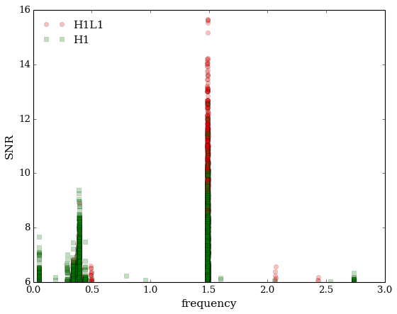
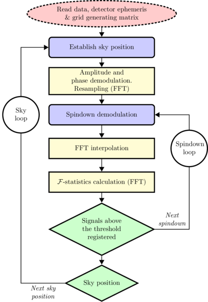

# F-statistic candidate signal search

Default (serial) version of the code for a network of detectors is available at [github](https://github.com/mbejger/polgraw-allsky/tree/master). To get it, run `git clone https://github.com/mbejger/polgraw-allsky.git`. 

### 1. Prerequisites

The code is written in standard `C`. [GNU Scientific Library (GSL)](http://www.gnu.org/software/gsl/) and the [FFTW library](http://www.fftw.org) (version 3.0 or later) are needed to run the code. [GNU struct dirent](http://www.gnu.org/software/libc/manual/html_node/Accessing-Directories.html#Accessing-Directories) objects are used to read the directories. 

Optionally, [SLEEF](http://shibatch.sourceforge.net) or
[YEPPP!](http://www.yeppp.info), libraries for high-performance computing that
are optimized for speed are used to evaluate the trigonometric functions in
`search`. These libraries are ported with the source code and are located in
`src/lib`. The choice which of these libraries to use has to be made at compilation time by
modifying the `Makefile`. 

### 2. Compilation

Run  `make search` or `make` (search is a default option). Resulting  binary is called `search`. 
Modify the `Makefile` to fit your system. By default the `YEPPP!` library is selected. 

### 3. How to run the program?

Minimal call of `search` is as follows (code compiled with the `GNUSINCOS` option): 
```
  ./search -d data_dir -o output_dir -i frame -b band  
```
where
 
* `data_dir` is the base directory of input data files,
* `output_dir`is a directory to write the output,
* `frame` is the number of time frame to be analyzed,
* `band` is the number of the frequency band (see the [data structure](#data_structure) description for details). 

#### 3.1. Full list of switches

| Switch          | Description       |
|-----------------|:------------------| 
|-d, -data        | Data directory (default is `.`)
|-o, -output      | Output directory (default is `./candidates`)
|-i, -ident       | Frame number
|-b, -band        | Band number
|-l, -label       | Custom label for the input and output files
|-r, -range       | File with grid range or pulsar position
|-c, -cwd         | Change to directory `<dir>`
|-t, -threshold   | Threshold for the F-statistic (default is 20)
|-h, -hemisphere  | Hemisphere (default is 0 - does both)
|-p, -fpo         | Reference band frequency fpo value
|-s, -dt          | Data sampling time dt (default value: 0.5)
|-x, -addsig      | Add signal with parameters from `<file>`

Also 

|                 |             | 
|-----------------|:------------|
| --whitenoise    |white Gaussian noise assumed | 
| --nospindown    |spindowns neglected | 
| --nocheckpoint  |state file will not be created (no checkpointing) |
| --help          |This help | 


#### 3.2. Network of detectors (`master` branch) 

For the examplary input data time streams `xdatc_001_101.bin` provided in [test-data-network.tar.gz](https://polgraw.camk.edu.pl/polgraw-allsky/data/test-data-network.tar.gz), the call is as follows: 
```
LD_LIBRARY_PATH=lib/yeppp-1.0.0/binaries/linux/x86_64 ./search -data ./test-data-network -ident 001 -band 101
```
where the `LD_LIBRARY_PATH` points to the location of the `YEPPP!` library. 

The program will proceed assuming that the data directory `./test-data-network/001` for the time frame `001` contain subdirectories for the network of detectors (here `H1` and `V1`) with input time series `xdatc_001_101.bin` and the ephemerids files `DetSSB.bin` in each subdirectory. The grid of parameters files is expected to be in `./test-data-network/001/grid.bin`. 

#### 3.3. Network of detectors in spotlight search (`spotlight` branch)
For the `H1L1` network of detectors, using the [test-data-network-injection.tar.gz](https://polgraw.camk.edu.pl/polgraw-allsky/data/test-data-network-injection.tar.gz) to search towards a pre-defined direction (spotlight search) in one 2-day segment: 
```
LD_LIBRARY_PATH=lib/yeppp-1.0.0/binaries/linux/x86_64 ./search -data ./test-data-network-injection -ident 205 -band 000 -spotlight ./test-data-network-injection/205/spot_J0322+0441.dat -fpo 1391.3 -label J0322+0441 -dt 2  
```
The injection corresponds to a pulsar J0322+0441. Note the differences with respect to the minimal call: 

* instead of calculating the band frequency `fpo` from `band`, we provide it directly with the `-fpo` switch (`-band 000` is invoked for legacy), 
* the input data is denoted with the pulsar label, hence the `-label` switch, 
* the sampling time `dt` is now set to `2s`,
* `-spotlight` switch points to the location of the spotlight file which contains the list of sky positions, and corresponding number and values of spindowns, in the following format: 
\begin{equation} 
h\, N_{sky}\, m_1\, n_1\, N^s_{1}\, s_{1}\, \dots\, s_{N^s_1}\, 
m_2\, n_2\, N^s_{2}\, s_1\, \dots\, s_{N^s_2}\, \dots,  
\end{equation} 
where $h$ is the hemisphere number (1 or 2), $N_{sky}$ is the total number of sky positions in a given spotlight search, $m_i$ and $n_i$ are the sky positions in linear (grid) coordinates, $N^s_{i}$ is the number of spindowns, and $s_{i}\,\dots\, s_{N^s_i}$ and the spindowns (in linear coordinates), corresponding to the $i-$th sky position.    

Results are as follows: 
##


#### 3.4. One-detector version 

In the case of `one-detector` and `gpu-current` versions, test data is in
[test-data.tar.gz](https://polgraw.camk.edu.pl/polgraw-allsky/data/test-data.tar.gz). 
The directory `001` contains directly the `DetSSB.bin`, `grid.bin` and `xdatc_001_101.bin` files. 

### 4. Data structure

<a id="data_structure"></a> 
We describe the structure using the VSR1 data as an example. 
Time of the first sample in MJD (Modified Julian Date) is 54239.00 
(corresponding to 2007/05/18, UTC 12:00). 

In this run the data was divided into 68 time frames, each of them 2 
sideral  days  long, rounded to half second (172328 seconds each). 
Since we use the sampling time of `0.5s`, total number of data points 
in each time frame is `N=344656`. 

Frames are labelled with three-digit consecutive number, 
from `001` to `068`. Frame label is the name of a subfolder, containing 
all narrowband sequences corresponding to that frame, e.g., `./042`.

Beginning MJD of each time frame is saved in the `nnn/starting_date` 
file:
```
   % cat 042/starting_date
   54320.7760185185
```
VSR1 database contains 929 narrow (1 Hz) bands, covering the range 
100 - 1000 Hz. Neighboring bands overlap by 0.03125 Hz. Beginning 
frequency `fpo` of each band is defined as 
```
   fpo = 100.0 + df * bbb [Hz],
```
where `df` $= 1 - 2^{-5} = 0.96875$ Hz, and `bbb` is the band number, 
ranging from 0 to 928.

### 5. Input data files

A single run requires 2 data files for each detector `DD`, stored in `data_dir/nnn/DD` 
subdirectory, where `DD` is `H1` (Hanford), `L1` (Livingston), or `V1` (Virgo Cascina):

   * `xdat_nnn_bbb.bin` - time-domain narrow-band data sequence, sampled
     at  half second. `nnn` is the number of time frame, `bbb` is the
     number of frequency band,

   * `DetSSB.bin`  -  location  of  the  detector  w.r.t. the Solar
   System Barycenter (SSB), in
     Cartesian coordinates, sampled at half second (3dim array of size `N`). 
     Last two records
     of  this file  are the angle `phir`, determining the  position of
     Earth in  its diurnal motion, and the obliquity of  the ecliptic
     `epsm`, both calculated for the first sample of the data,

as we as the sky positions-frequency-spindown grid file in linear coordinates 
(common for all the detectors), stored in `data_dir/nnn`: 

   * `grid.bin` - generator matrix of an optimal grid of templates. 

### 6. Output files

Binary output  files,   containing  trigger  events   above  an  arbitrary
threshold, are written to  the output_dir directory.  There are two output
files for every input data sequence: `triggers_nnn_bbb_1.bin` and
`triggers_nnn_bbb_2.bin`,  where  `1`  and  `2` correspond to  northern  and
southern  ecliptic  hemisphere. Every trigger (candidate) event  occupies `40`
consecutive bytes (5 double numbers), with the following meaning:

Record no.            | 
--------------------- | ---------------------------- 
1                     | frequency [radians, between 0 and $\pi$] above `fpo`  
2                     | spindown [Hz s<sup>-1</sup>]  
3                     | declination [radians]
4                     | right ascension [radians]
5                     | signal to noise ratio

### 7. Auxiliary files

There is a couple of auxiliary files created by the `search` 
in the working directory:

* `wisdom-hostname.dat` - "wisdom" file created by the `FFTW`. The `hostname` 
variable is determined by a call to `gethostname()`, 

* `state_nnn_bbb.dat` - checkpoint file.  The  search can  be safely restarted, calculations will continue  from the last grid position saved to this file. After successful termination, checkpoint file is left empty.

### 8. Algorithm flowchart
##



### 9. Versions

Polgraw-allsky code comes also as an
[MPI](http://www.sciencedirect.com/science/article/pii/S0010465514003774),
[network of detectors spotlight
search](https://github.com/mbejger/polgraw-allsky/tree/spotlight) and a
[GPU](https://github.com/mbejger/polgraw-allsky/tree/gpu-current) (currently
one detector) version. 

